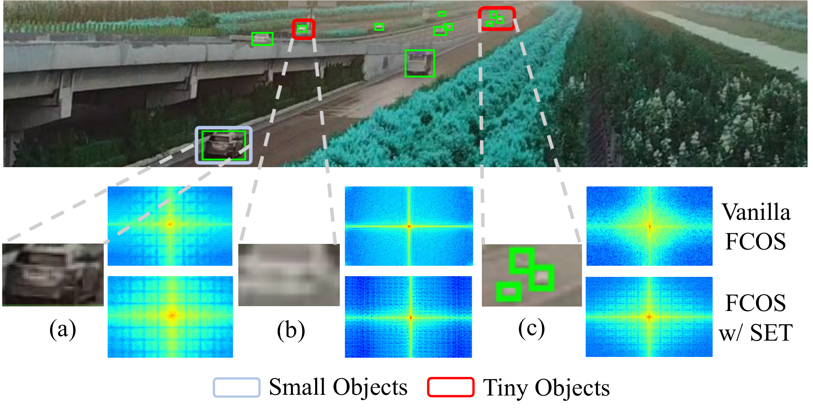

<h1 align="center">SET: Spectral Enhancement for Tiny Object Detection</h1>

<p align="center" style="font-size: 1.05em">
  Huixin Sun, Runqi Wang, Yanjing Li, Linlin Yang, Shaohui Lin, Xianbin Cao, Baochang Zhang<br/>
  <a href="https://openaccess.thecvf.com/content/CVPR2025/papers/Sun_SET_Spectral_Enhancement_for_Tiny_Object_Detection_CVPR_2025_paper.pdf"></a>
  <a href="https://openaccess.thecvf.com/content/CVPR2025/papers/Sun_SET_Spectral_Enhancement_for_Tiny_Object_Detection_CVPR_2025_paper.pdf"></a>
</p>

<p align="center" style="line-height: 1.1; margin: 0.2em 0;">
  <a href="mmdet/models/detectors/fcos_set.py"></a><a href="configs/aitod/"></a><a href="checkpoints/"></a><a href="run_pca.sh"></a><a href="run_saliency.sh"></a>
</p>

This repository releases the core training and evaluation code of SET (CVPR 2025), together with two visualization tools for the HBS and API modules in the paper.

## Why SET?

- Suppresses high-frequency noise in the background through adaptive smoothing operations (HBS)
- Leverages adversarial perturbations to increase feature saliency in critical regions and prompt the refinement of object features during training (API)
- Applied during training only, with no extra burden at inference

<p align="center">
  
  <br/>
  <em>SET overview.</em>
</p>

## Environment

```bash
conda create -n set python=3.9 -y && conda activate set
conda install pytorch==1.12.1 torchvision==0.13.1 cudatoolkit=11.3 -c pytorch

pip install -U openmim && mim install mmcv-full==1.6.0
pip install -v -e .
pip install -r requirements/runtime.txt

cd cocoapi-aitod-master/aitodpycocotools && pip install -v -e .
```

Download [AI-TOD](https://github.com/jwwangchn/AI-TOD) to `data/aitod/`.

## Training

Configs for AI-TOD are under [`configs/aitod/`](configs/aitod/):

| Config | Model |
|--------|-------|
| [`fcos_r50_baseline.py`](configs/aitod/fcos_r50_baseline.py) | FCOS baseline |
| [`fcos_r50_set.py`](configs/aitod/fcos_r50_set.py) | FCOS w/ SET |

Use [`scripts/train.sh`](scripts/train.sh) with `CONFIG`, number of `GPUS`, and `WORK_DIR`:

```bash
bash scripts/train.sh configs/aitod/fcos_r50_baseline.py 4 output/fcos_baseline
bash scripts/train.sh configs/aitod/fcos_r50_set.py 4 output/fcos_set
```

## Evaluation

Use [`scripts/eval.sh`](scripts/eval.sh) with `CONFIG`, `CHECKPOINT`, and number of `GPUS`:

```bash
bash scripts/eval.sh configs/aitod/fcos_r50_baseline.py checkpoints/aitod_fcos_r50_baseline_epoch12.pth 1
bash scripts/eval.sh configs/aitod/fcos_r50_set.py checkpoints/aitod_fcos_set_epoch12.pth 1
```

Pretrained checkpoints are available in [`checkpoints/`](checkpoints/):

| Model | Checkpoint | Config |
|-------|------------|--------|
| FCOS baseline | `aitod_fcos_r50_baseline_epoch12.pth` | `configs/aitod/fcos_r50_baseline.py` |
| FCOS w/ SET | `aitod_fcos_set_epoch12.pth` | `configs/aitod/fcos_r50_set.py` |

Results on AI-TOD (Table 1 in the paper). ResNet-50, 800×800, 12 epochs, trainval to test:

| Method | AP | AP50 | AP75 | APvt | APt | APs |
|--------|-----|------|------|------|-----|-----|
| FCOS | 12.0 | 29.0 | 8.0 | 2.5 | 11.9 | 17.1 |
| FCOS w/ SET | 14.2 | 34.9 | 9.8 | 2.9 | 13.0 | 20.2 |

## Visualization

Each tool visualizes one of the two core modules:

| Module | Role | Tool |
|--------|------|------|
| HBS | Background smoothing | [`run_pca.sh`](run_pca.sh) — background feature PCA |
| API | Feature saliency enhancement | [`run_saliency.sh`](run_saliency.sh) — per instance saliency on original images |

Requires `scikit-learn`, `matplotlib`, and `opencv-python`.

```bash
# HBS: background smoothing (Fig. 4)
bash run_pca.sh

# API: feature saliency enhancement (Fig. 5)
bash run_saliency.sh
```

## Citation

If you find SET useful in your research, please cite:

```bibtex
@inproceedings{sun2025set,
  title={SET: Spectral Enhancement for Tiny Object Detection},
  author={Sun, Huixin and Wang, Runqi and Li, Yanjing and Yang, Linlin and Lin, Shaohui and Cao, Xianbin and Zhang, Baochang},
  booktitle={CVPR},
  year={2025}
}
```

## Acknowledgements

[MMDetection](https://github.com/open-mmlab/mmdetection) and [cocoapi-aitod](https://github.com/jwwangchn/cocoapi-aitod).
