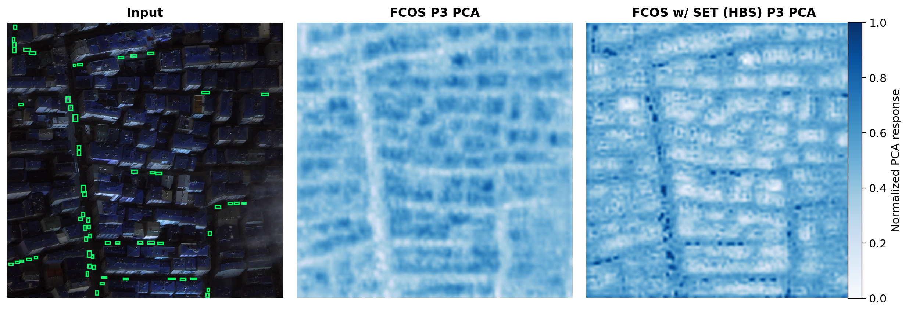
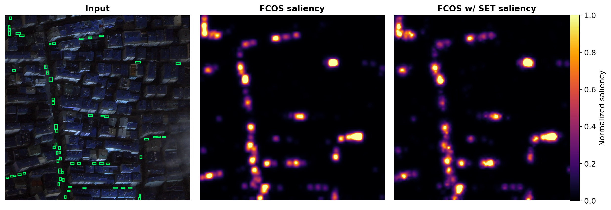

# SET: Spectral Enhancement for Tiny Object Detection

[](https://openaccess.thecvf.com/content/CVPR2025/papers/Sun_SET_Spectral_Enhancement_for_Tiny_Object_Detection_CVPR_2025_paper.pdf)

Official PyTorch implementation of **SET** (CVPR 2025), built on [MMDetection](https://github.com/open-mmlab/mmdetection) 2.23.

<p align="center">
  
</p>

> **SET: Spectral Enhancement for Tiny Object Detection**  
> Huixin Sun, Runqi Wang, Yanjing Li, Linlin Yang, Shaohui Lin, Xianbin Cao, Baochang Zhang  
> [Paper](https://openaccess.thecvf.com/content/CVPR2025/papers/Sun_SET_Spectral_Enhancement_for_Tiny_Object_Detection_CVPR_2025_paper.pdf)

**This repository provides the full training and evaluation code for SET, together with two visualization tools that directly correspond to its core modules:**

| Module | Role | Visualization |
|--------|------|---------------|
| **HBS** (Hierarchical Background Smoothing) | Suppresses high frequency background noise via adaptive spectral smoothing | [`run_pca.sh`](run_pca.sh): background feature PCA (Fig. 4) |
| **API** (Adversarial Perturbation Injection) | Enhances tiny object feature saliency through adversarial perturbation during training | [`run_saliency.sh`](run_saliency.sh): feature saliency maps (Fig. 5) |

Together, the code and visualizations offer a reproducible view of *how* SET reshapes the feature spectrum: smoothing cluttered backgrounds while sharpening tiny instance representations.

## Abstract

Tiny object detection remains challenging because tiny instances become less distinct after feature encoding and are easily overwhelmed by high frequency background noise. **SET** amplifies the frequency signatures of tiny objects via a heterogeneous architecture with two modules:

- **HBS**: suppresses high frequency noise in the background through adaptive smoothing.
- **API**: injects feature level adversarial perturbations to increase saliency during training.

SET is applied during training only and introduces **no extra cost at inference**.

## Results on AI-TOD (Table 1)

ResNet-50, 800×800, 12 epochs, trainval to test.

| Method | AP | AP50 | AP75 | APvt | APt | APs |
|--------|-----|------|------|------|-----|-----|
| FCOS | 12.0 | 29.0 | 8.0 | 2.5 | 11.9 | 17.1 |
| **FCOS w/ SET** | **14.2** | **34.9** | **9.8** | **2.9** | **13.0** | **20.2** |

Pretrained checkpoints: [`checkpoints/`](checkpoints/)

## Installation

```bash
conda create -n set python=3.9 -y && conda activate set
conda install pytorch==1.12.1 torchvision==0.13.1 cudatoolkit=11.3 -c pytorch

pip install -U openmim && mim install mmcv-full==1.6.0
pip install -v -e .
pip install -r requirements/runtime.txt

cd cocoapi-aitod-master/aitodpycocotools && pip install -v -e .
```

## Dataset

Download [AI-TOD](https://github.com/jwwangchn/AI-TOD) to `data/aitod/` (train, val, and test splits).

## Training & Evaluation

```bash
# Train
bash scripts/train.sh configs/aitod/fcos_r50_baseline.py 4 output/fcos_baseline
bash scripts/train.sh configs/aitod/fcos_r50_set.py 4 output/fcos_set

# Eval
bash scripts/eval.sh configs/aitod/fcos_r50_baseline.py checkpoints/aitod_fcos_r50_baseline_epoch12.pth 1
bash scripts/eval.sh configs/aitod/fcos_r50_set.py checkpoints/aitod_fcos_set_epoch12.pth 1
```

## Visualization

We release two standalone tools that mirror the two SET modules, **background smoothing (HBS)** and **feature saliency enhancement (API)**, so you can inspect their effects directly on tiny objects.

| Tool | Module | What it shows |
|------|--------|---------------|
| [`run_pca.sh`](run_pca.sh) | **HBS**: background smoothing | PCA of FPN features: FCOS vs. FCOS w/ HBS (Fig. 4) |
| [`run_saliency.sh`](run_saliency.sh) | **API**: feature saliency enhancement | Saliency maps: FCOS vs. FCOS w/ SET (Fig. 5) |

Requires `scikit-learn`, `matplotlib`, and `opencv-python`.

```bash
# HBS: background smoothing (Fig. 4)
bash run_pca.sh

# API: feature saliency enhancement (Fig. 5)
bash run_saliency.sh
```

Outputs are saved to `vis/pca/` and `vis/saliency/` as PDF and PNG. Representative results from the paper:

<p align="center">
  
  <br/>
  <em>Fig. 4. Background feature PCA. HBS compresses high frequency background variance, yielding a smoother spectral structure.</em>
</p>

<p align="center">
  
  <br/>
  <em>Fig. 5. Feature saliency maps. API amplifies tiny object responses, making instances more distinguishable from background clutter.</em>
</p>

## Citation

If you find SET useful in your research, please cite:

```bibtex
@inproceedings{sun2025set,
  title={SET: Spectral Enhancement for Tiny Object Detection},
  author={Sun, Huixin and Wang, Runqi and Li, Yanjing and Yang, Linlin and Lin, Shaohui and Cao, Xianbin and Zhang, Baochang},
  booktitle={CVPR},
  year={2025}
}
```

## Acknowledgements

Built upon [MMDetection](https://github.com/open-mmlab/mmdetection) and [cocoapi-aitod](https://github.com/jwwangchn/cocoapi-aitod).
